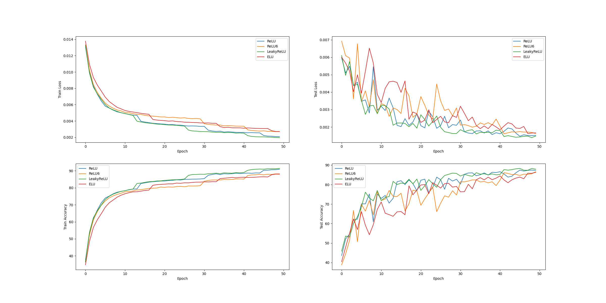
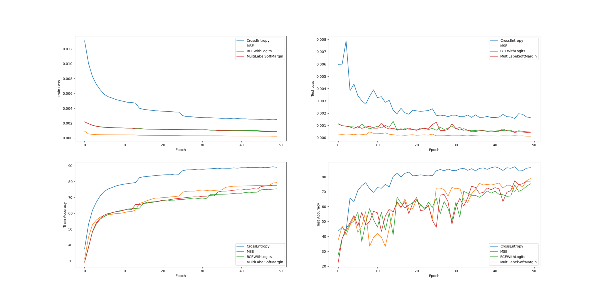
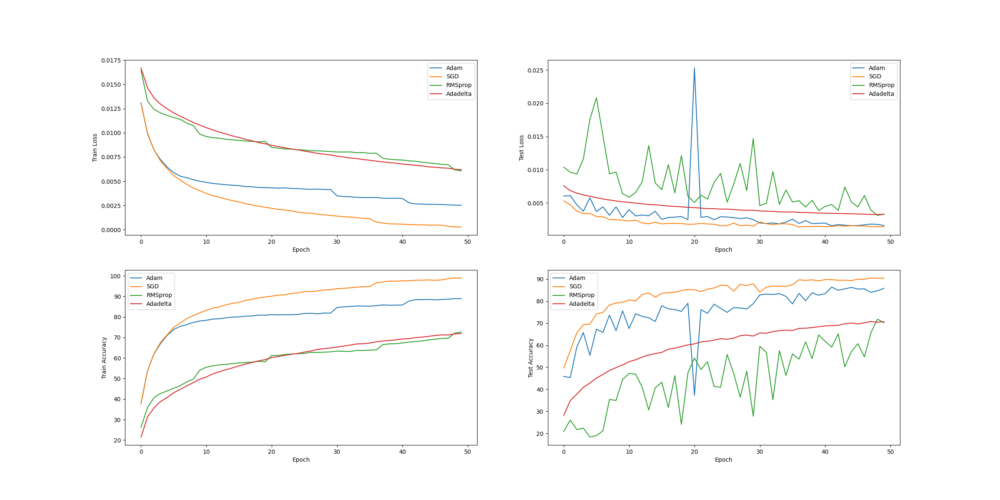
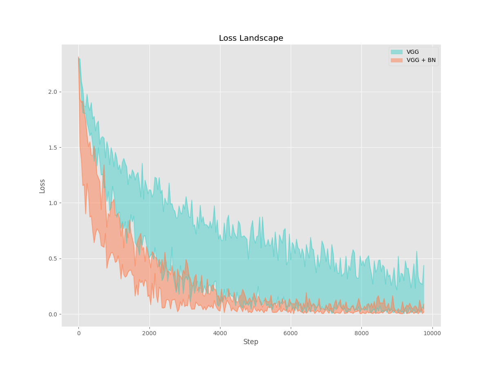

# NNDL_project2
The second project for Neural Network and Deep Learning: Train a network on CIFAR-10 and explore Batch Normalization.

## CIFAR-10

### General Results

The models are trained under a max epoch of 100.

|      Model      | #Parameters | Train Accuracy (%) | Test Accuracy (%) |
| :-------------: | :---------: | :----------------: | :---------------: |
|    ResNet18     |  11173962   |       95.32        |       92.06       |
| ResNeXt50_32x4d |             |                    |                   |
|      DPN26      |             |                    |                   |
|       DLA       |             |                    |                   |
|   DenseNet121   |   6956298   |       99.98        |       92.94       |

### Best Model

|    Model    | Data Augmentation | Epoch | #Parameters | Activation |     Loss     | Optimizer | Train Accuracy (%) | Test Accuracy (%) |
| :---------: | :---------------: | :---: | :---------: | ---------- | :----------: | :-------: | :----------------: | :---------------: |
| DenseNet121 |      cutout       |  200  |             | LeakyReLu  | CrossEntropy |   Adam    |                    |                   |

### Comparison

Use baseline **ResNet18** to compare different choice of activations, losses and optimizers.

#### Activation

#### Loss

#### Optimizer

## Batch Normalization

Use baseline **VGG-A** to compare the effect of batch normalization on loss landscape.

